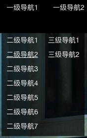
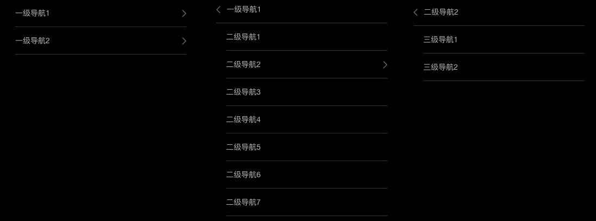

# auto-nav

auto-nav是一个根据配置文件`config.js`，自动生成[Ferragamo.com](http://www.ferragamo.cn)首页导航栏的工具。

## Install

```
// 安装node
$ npm install node
```

## Usage

### config.js

每一级导航是一个对象，有`title href node`三个属性。

`title`是导航的名称。`href`是该导航点击时跳转的链接，若没有此属性，则此导航点击没有动作。`node`是导航的子目录，是包含了下一层级导航对象的数组。

需要注意的是：

- 只有`title`属性是必须的属性。
- `href`属性的值为相对链接。
- 导航层级最深为三级导航。

``` js
// 样例
module.exports = [{
  'title': '一级导航1',
  // 'href': 'link-to-page.html',
  'node': [{
    'title': '二级导航1',
    'href': 'link-to-page.html',
  }, {
    'title': '二级导航2',
    // 'href': 'link-to-page.html',
    'node': [{
      'title': '三级导航1',
      'href': 'link-to-page.html',
    }, {
      'title': '三级导航2',
      'href': 'link-to-page.html',
    }],
  }, {
    'title': '二级导航3',
    'href': 'link-to-page.html',
  }, {
    'title': '二级导航4',
    'href': 'link-to-page.html',
  }, {
    'title': '二级导航5',
    'href': 'link-to-page.html',
  }, {
    'title': '二级导航6',
    'href': 'link-to-page.html',
  }, {
    'title': '二级导航7',
    'href': 'link-to-page.html',
  }],
}, {
  'title': '一级导航2',
  // 'href': 'link-to-page.html',
  'node': [{
    'title': '三级导航3',
    'href': 'link-to-page.html',
  }, {
    'title': '三级导航4',
    'href': 'link-to-page.html',
  }, {
    'title': '三级导航5',
    'href': 'link-to-page.html',
  }],
}]
```

### terminal

在auto-nav文件夹下，运行生成命令。

```
$ node getnav.js
---------------

Darwin user:
use CTRL + V to paste nav html.

---------------
```

额，如果你没出现这行字，那么请手动复制，谢谢。

## Result

没有在`config.js`中配置`href`属性的导航，点击无动作；其余导航跳转至对应`href`链接。

### PC



### Mobile

